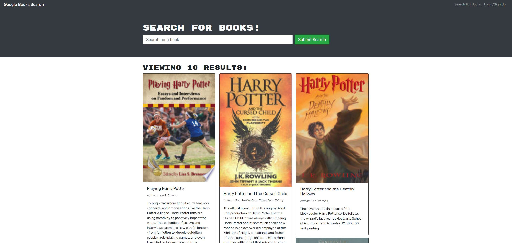
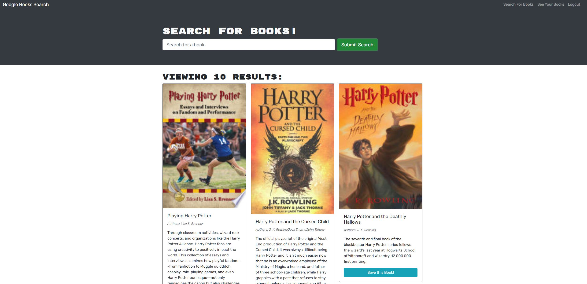
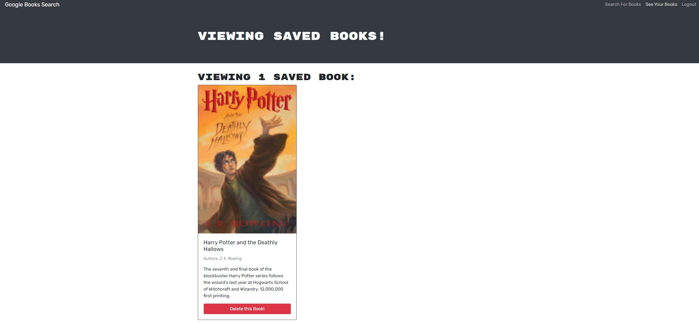

# book-search-engine - 
Refactoring a fully functional Google Books API search engine built with a RESTful API to be a GraphQL API built with Apollo Server
## **Description**
The `Google Books Search` is a search engine using GraphQL queries and mutations. Users are able to search for books and save books to refer to later. Saved books are able to be removed as well.

## **Table of Contents**

- [Installation](#installation)
- [Usage](#usage)
- [License](#license)
- [Technology](#technology)
- [Questions](#questions)

## **Installation**

To install this application, make a `clone` of this repository to your local machine. Open the repository in your code editor of choice 🖥️. Run `npm run start` from the client folder to view in web browser. OR visit deployed site at link provided below:

[Visit Deployed Site](https://book-search-engine-cc.herokuapp.com/)

## **Usage**

- Any users may search for books and pull up a query of book results. These results include an image of the book if applicable, the book title, the book author, and a brief description of the book.
- Users must `Sign Up` or `Login` to be able to add and remove books from their `Saved Books` page.

Home Page:

Login Form:

Sign Up Form:

Logged Out User - Search View:

Logged In User - Search View:

Save Book Message View:

Saved Books View:

## **License**

MIT License

Copyright &copy; 2022 Cheryl Caitano

Permission is hereby granted, free of charge, to any person obtaining a copy
of this software and associated documentation files (the "Software"), to deal
in the Software without restriction, including without limitation the rights
to use, copy, modify, merge, publish, distribute, sublicense, and/or sell
copies of the Software, and to permit persons to whom the Software is
furnished to do so, subject to the following conditions:

The above copyright notice and this permission notice shall be included in all
copies or substantial portions of the Software.

THE SOFTWARE IS PROVIDED "AS IS", WITHOUT WARRANTY OF ANY KIND, EXPRESS OR
IMPLIED, INCLUDING BUT NOT LIMITED TO THE WARRANTIES OF MERCHANTABILITY,
FITNESS FOR A PARTICULAR PURPOSE AND NONINFRINGEMENT. IN NO EVENT SHALL THE
AUTHORS OR COPYRIGHT HOLDERS BE LIABLE FOR ANY CLAIM, DAMAGES OR OTHER
LIABILITY, WHETHER IN AN ACTION OF CONTRACT, TORT OR OTHERWISE, ARISING FROM,
OUT OF OR IN CONNECTION WITH THE SOFTWARE OR THE USE OR OTHER DEALINGS IN THE
SOFTWARE.

## **Technology**

- [JavaScript](https://www.javascript.com/) Scripting Language
- [Node](https://nodejs.org/en/) JavaScript runtime
- [npm](https://www.npmjs.com/) Inquirer, Express, UUID, etc.
- [Express]() Express.js
- [MongoDB](https://www.mongodb.com/) MongoDB
- [Mongoose](https://mongoosejs.com/docs/middleware.html) Mongoose Middleware
- [React](https://reactjs.org/) JavaScript Libary for Building User Interfaces
- [Heroku](https://www.heroku.com/) Platform as a Service (PaaS)

## **Questions**

For any questions or contributions please contact me on Github or by e-mail:

[Github Profile](https://www.github.com/ccaitano)  
[Email Me](mailto:cheryl.caitano@gmail.com)
